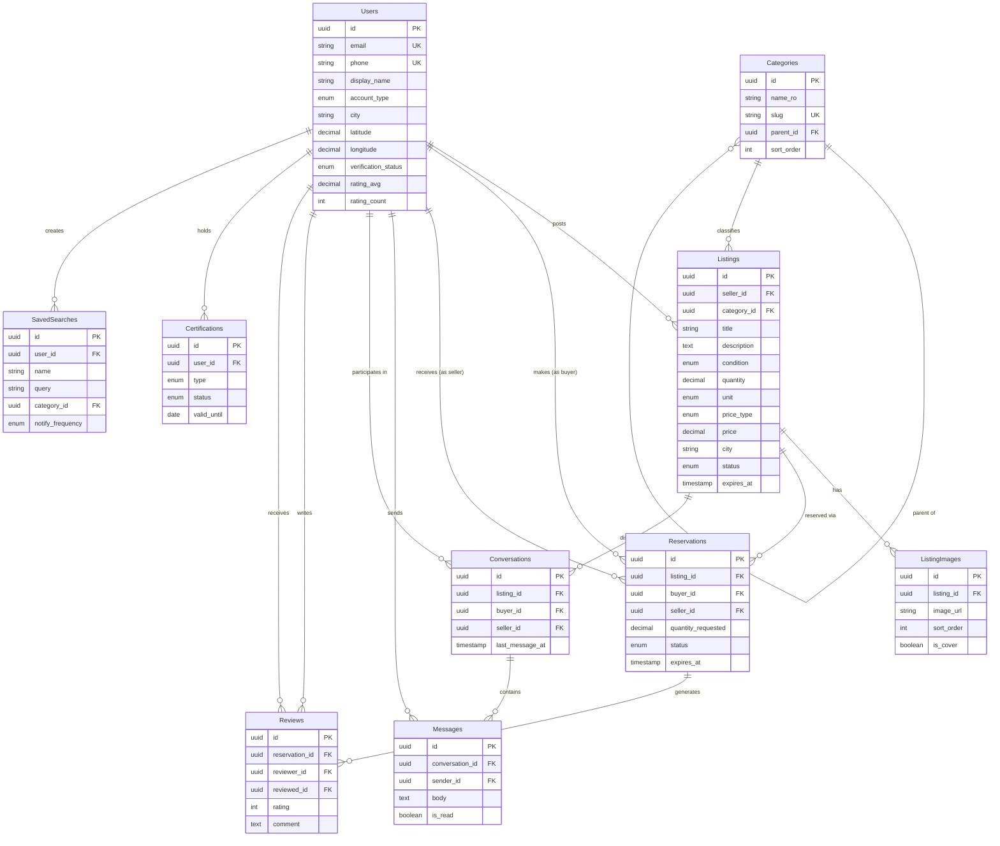

# ReMatero — Data Model Design

## Entity Overview

```
Users ──< Listings >── Categories
  │           │
  │           ├──< ListingImages
  │           │
  │           ├──< Reservations >── Users (buyer)
  │           │
  │           └──< Messages >── Users (sender/receiver)
  │
  ├──< Reviews (as reviewer / as reviewed)
  │
  ├──< Certifications
  │
  └──< SavedSearches
```

## Entities

---

### Users

The central entity representing all platform participants (sellers and buyers).

| Field | Type | Description | Constraints |
|-------|------|-------------|-------------|
| id | UUID | Primary identifier | PK, auto-generated |
| email | String | Login email | Unique, required |
| password_hash | String | Hashed password | Required |
| phone | String | Phone number | Unique, required, verified |
| display_name | String | Public display name | Required, 2-50 chars |
| avatar_url | String | Profile photo URL | Optional |
| bio | Text | Short description | Optional, max 500 chars |
| account_type | Enum | `individual` / `company` | Required |
| company_name | String | Company legal name | Required if company |
| company_cui | String | Company fiscal code (CUI) | Optional, unique |
| city | String | Primary city | Required |
| address | String | Full address | Optional |
| latitude | Decimal | Geo latitude | Optional |
| longitude | Decimal | Geo longitude | Optional |
| phone_visible | Boolean | Show phone on profile | Default: false |
| verification_status | Enum | `unverified` / `basic` / `verified` / `pro` | Default: unverified |
| rating_avg | Decimal | Average rating (cached) | Default: 0, 0.0-5.0 |
| rating_count | Integer | Total ratings received | Default: 0 |
| is_active | Boolean | Account active | Default: true |
| created_at | Timestamp | Registration date | Auto |
| updated_at | Timestamp | Last profile update | Auto |

---

### Categories

Hierarchical taxonomy for construction materials.

| Field | Type | Description | Constraints |
|-------|------|-------------|-------------|
| id | UUID | Primary identifier | PK |
| name_ro | String | Romanian name | Required |
| name_en | String | English name | Optional |
| slug | String | URL-safe identifier | Unique, required |
| parent_id | UUID | Parent category | FK → Categories, nullable |
| icon | String | Icon identifier | Optional |
| sort_order | Integer | Display order | Default: 0 |
| is_active | Boolean | Visible in UI | Default: true |

**Default Category Tree:**
```
├── Zidărie (Masonry)
│   ├── Cărămidă (Brick)
│   ├── BCA (Aerated concrete)
│   ├── Blocuri beton (Concrete blocks)
│   └── Mortar & adezivi (Mortar & adhesives)
├── Lemn (Wood)
│   ├── Cherestea (Lumber)
│   ├── Grinzi (Beams)
│   ├── Parchet (Flooring)
│   ├── OSB / Placaj (OSB / Plywood)
│   └── Scândură (Planks)
├── Metal
│   ├── Oțel beton (Rebar)
│   ├── Profile metalice (Steel profiles)
│   ├── Tablă (Sheet metal)
│   └── Țevi metalice (Metal pipes)
├── Finisaje (Finishes)
│   ├── Gresie (Floor tiles)
│   ├── Faianță (Wall tiles)
│   ├── Vopsea (Paint)
│   └── Tencuială (Plaster)
├── Instalații (Plumbing / Electrical)
│   ├── Țevi PVC/PPR (PVC/PPR pipes)
│   ├── Cabluri electrice (Electrical cables)
│   ├── Prize & întrerupătoare (Sockets & switches)
│   └── Robineți & fitinguri (Faucets & fittings)
├── Acoperișuri (Roofing)
│   ├── Țiglă (Roof tiles)
│   ├── Tablă acoperire (Roofing sheet)
│   └── Jgheaburi (Gutters)
├── Izolații (Insulation)
│   ├── Polistiren (Polystyrene)
│   ├── Vată minerală (Mineral wool)
│   └── Folie & bariere (Film & barriers)
├── Feronerie (Hardware)
│   ├── Șuruburi & cuie (Screws & nails)
│   ├── Dibluri & ancore (Dowels & anchors)
│   └── Balamale & încuietori (Hinges & locks)
├── Uși & Ferestre (Doors & Windows)
│   ├── Uși interioare (Interior doors)
│   ├── Uși exterioare (Exterior doors)
│   └── Ferestre (Windows)
└── Altele (Other)
```

---

### Listings

Materials posted for sale or donation.

| Field | Type | Description | Constraints |
|-------|------|-------------|-------------|
| id | UUID | Primary identifier | PK |
| seller_id | UUID | Listing owner | FK → Users, required |
| title | String | Listing title | Required, 5-100 chars |
| description | Text | Detailed description | Required, 20-2000 chars |
| category_id | UUID | Material category | FK → Categories, required |
| condition | Enum | `new` / `very_good` / `good` / `acceptable` | Required |
| quantity | Decimal | Amount available | Required, > 0 |
| unit | Enum | `buc` / `m2` / `m3` / `kg` / `tone` / `paleti` / `lot` | Required |
| price_type | Enum | `fixed` / `negotiable` / `free` | Required |
| price | Decimal | Price amount | Required if fixed/negotiable |
| price_per | Enum | `unit` / `lot` | Required if priced |
| currency | String | Currency code | Default: RON |
| city | String | Material location city | Required |
| address | String | Specific address | Optional |
| latitude | Decimal | Geo latitude | Optional |
| longitude | Decimal | Geo longitude | Optional |
| availability | Enum | `available_now` / `available_from` | Default: available_now |
| available_from | Date | Available starting date | Required if available_from |
| status | Enum | `active` / `reserved` / `sold` / `withdrawn` / `expired` | Default: active |
| view_count | Integer | Total views | Default: 0 |
| inquiry_count | Integer | Total inquiries | Default: 0 |
| is_urgent | Boolean | Marked as time-sensitive | Default: false |
| expires_at | Timestamp | Auto-expire date | Optional, default +30 days |
| created_at | Timestamp | Creation date | Auto |
| updated_at | Timestamp | Last update | Auto |

---

### ListingImages

Photos associated with listings.

| Field | Type | Description | Constraints |
|-------|------|-------------|-------------|
| id | UUID | Primary identifier | PK |
| listing_id | UUID | Parent listing | FK → Listings, required |
| image_url | String | Stored image URL | Required |
| thumbnail_url | String | Thumbnail URL | Required |
| sort_order | Integer | Display order | Default: 0 |
| is_cover | Boolean | Primary image | Default: false |
| created_at | Timestamp | Upload date | Auto |

---

### Reservations

Material reservation tracking between buyers and sellers.

| Field | Type | Description | Constraints |
|-------|------|-------------|-------------|
| id | UUID | Primary identifier | PK |
| listing_id | UUID | Reserved listing | FK → Listings, required |
| buyer_id | UUID | Reserving buyer | FK → Users, required |
| seller_id | UUID | Listing seller | FK → Users, required |
| quantity_requested | Decimal | Amount buyer wants | Required, > 0 |
| message | Text | Buyer's note to seller | Optional, max 500 chars |
| status | Enum | `pending` / `accepted` / `rejected` / `completed` / `cancelled` / `expired` | Default: pending |
| expires_at | Timestamp | Reservation expiry | Required, default +48h |
| responded_at | Timestamp | Seller response time | Nullable |
| completed_at | Timestamp | Transaction completed | Nullable |
| created_at | Timestamp | Reservation date | Auto |
| updated_at | Timestamp | Last status change | Auto |

---

### Messages

In-app messaging between users about specific listings.

| Field | Type | Description | Constraints |
|-------|------|-------------|-------------|
| id | UUID | Primary identifier | PK |
| conversation_id | UUID | Conversation thread | FK → Conversations, required |
| sender_id | UUID | Message author | FK → Users, required |
| body | Text | Message content | Required, max 2000 chars |
| image_url | String | Attached image | Optional |
| is_read | Boolean | Read by recipient | Default: false |
| created_at | Timestamp | Sent date | Auto |

### Conversations

Conversation threads between two users about a listing.

| Field | Type | Description | Constraints |
|-------|------|-------------|-------------|
| id | UUID | Primary identifier | PK |
| listing_id | UUID | Related listing | FK → Listings, required |
| buyer_id | UUID | Buyer participant | FK → Users, required |
| seller_id | UUID | Seller participant | FK → Users, required |
| last_message_at | Timestamp | Last activity | Auto-updated |
| buyer_unread_count | Integer | Unread by buyer | Default: 0 |
| seller_unread_count | Integer | Unread by seller | Default: 0 |
| created_at | Timestamp | Thread start date | Auto |

---

### Reviews

Post-transaction ratings and reviews.

| Field | Type | Description | Constraints |
|-------|------|-------------|-------------|
| id | UUID | Primary identifier | PK |
| reservation_id | UUID | Related transaction | FK → Reservations, required, unique pair with reviewer |
| reviewer_id | UUID | Person leaving review | FK → Users, required |
| reviewed_id | UUID | Person being reviewed | FK → Users, required |
| rating | Integer | Star rating | Required, 1-5 |
| comment | Text | Review text | Optional, max 1000 chars |
| reviewer_role | Enum | `buyer` / `seller` | Required |
| created_at | Timestamp | Review date | Auto |

---

### Certifications (Phase 2+)

Verification and certification records.

| Field | Type | Description | Constraints |
|-------|------|-------------|-------------|
| id | UUID | Primary identifier | PK |
| user_id | UUID | Certified user | FK → Users, required |
| type | Enum | `basic` / `verified` / `pro` | Required |
| document_url | String | Uploaded document | Optional |
| verified_by | String | Verifier identity | Optional |
| status | Enum | `pending` / `approved` / `rejected` | Default: pending |
| valid_until | Date | Certification expiry | Optional |
| notes | Text | Admin notes | Optional |
| created_at | Timestamp | Submission date | Auto |
| reviewed_at | Timestamp | Review date | Nullable |

---

### SavedSearches (Phase 2+)

User's saved search criteria for notifications.

| Field | Type | Description | Constraints |
|-------|------|-------------|-------------|
| id | UUID | Primary identifier | PK |
| user_id | UUID | Search owner | FK → Users, required |
| name | String | User-given label | Required |
| query | String | Search text | Optional |
| category_id | UUID | Category filter | FK → Categories, optional |
| city | String | Location filter | Optional |
| radius_km | Integer | Search radius | Optional |
| condition_min | Enum | Minimum condition | Optional |
| price_max | Decimal | Max price | Optional |
| price_type | Enum | Filter by free/priced | Optional |
| notify_frequency | Enum | `instant` / `daily` / `weekly` | Default: daily |
| is_active | Boolean | Notifications enabled | Default: true |
| created_at | Timestamp | Created date | Auto |

---

## Entity-Relationship Diagram



## Indexing Strategy

| Entity | Index | Type | Purpose |
|--------|-------|------|---------|
| Users | email | Unique | Login lookup |
| Users | phone | Unique | Phone verification |
| Users | city | Standard | Location queries |
| Listings | seller_id | Standard | "My listings" queries |
| Listings | category_id | Standard | Category browsing |
| Listings | status | Standard | Active listing filters |
| Listings | city | Standard | Location search |
| Listings | (latitude, longitude) | Spatial/Composite | Proximity search |
| Listings | created_at | Standard | Sort by newest |
| Listings | title, description | Full-text | Search functionality |
| Reservations | buyer_id | Standard | "My reservations" |
| Reservations | listing_id | Standard | Listing reservation check |
| Reservations | status | Standard | Active reservation filters |
| Conversations | (buyer_id, listing_id) | Unique composite | One conversation per buyer per listing |
| Messages | conversation_id | Standard | Thread retrieval |
| Reviews | reviewed_id | Standard | Profile reviews |

---

*Related docs: [FEATURES.md](./FEATURES.md) | [ARCHITECTURE.md](./ARCHITECTURE.md) | [TRUST-SYSTEM.md](./TRUST-SYSTEM.md)*
