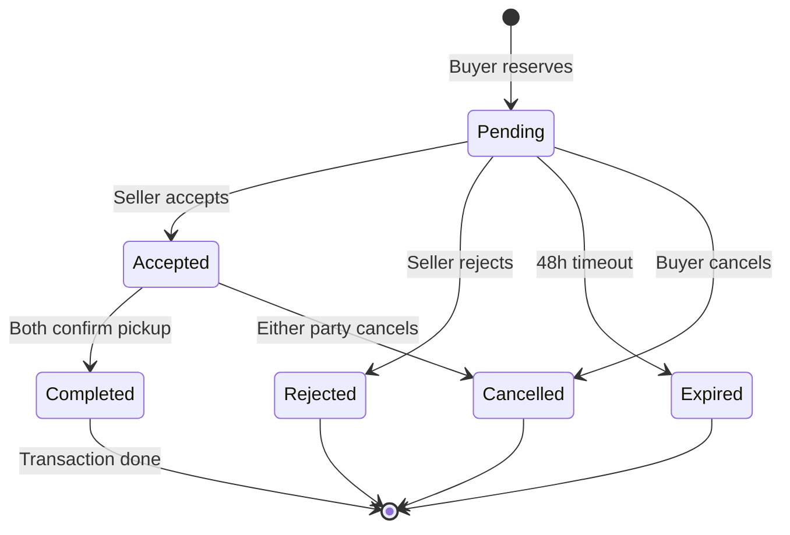

# ReMatero — User Journeys

## Overview

This document maps the key user flows through the platform. Each flow includes the steps, decision points, and system responses. See [USER-PERSONAS.md](./USER-PERSONAS.md) for the personas referenced below.

---

## Flow 1: Seller Registration & Profile Setup

**Persona:** Andrei (S1 — Construction Company Manager)

```
┌─────────────┐     ┌──────────────┐     ┌────────────────┐     ┌──────────────┐
│  Landing     │────>│  Register    │────>│  Verify Phone  │────>│  Setup       │
│  Page        │     │  (Email+Pass)│     │  (SMS OTP)     │     │  Profile     │
└─────────────┘     └──────────────┘     └────────────────┘     └──────┬───────┘
                                                                       │
                                                          ┌────────────┴────────────┐
                                                          │                         │
                                                   ┌──────▼──────┐          ┌───────▼──────┐
                                                   │  Individual │          │  Company     │
                                                   │  Profile    │          │  Profile     │
                                                   └──────┬──────┘          └───────┬──────┘
                                                          │                         │
                                                          └────────────┬────────────┘
                                                                       │
                                                                ┌──────▼──────┐
                                                                │  Dashboard  │
                                                                │  (Ready!)   │
                                                                └─────────────┘
```

### Steps

1. **Landing Page** → User clicks "Înregistrează-te" (Register)
2. **Registration Form**
   - Email, password (min 8 chars), confirm password
   - Accept terms of service
   - System: validate email uniqueness, password strength
3. **Phone Verification**
   - Enter phone number → receive SMS code → enter code
   - System: send OTP, validate, mark phone as verified
4. **Profile Setup**
   - Choose: "Persoană fizică" (Individual) / "Firmă" (Company)
   - **Individual:** display name, city, avatar (optional)
   - **Company:** company name, CUI, display name, city, avatar
   - Contact preference: "Doar mesaje în aplicație" / "Afișează telefonul"
5. **Dashboard** → "Bine ai venit! Creează primul tău anunț." (Welcome! Create your first listing.)

### Error States
- Email already registered → "Acest email este deja folosit. Ai uitat parola?"
- Invalid OTP → "Codul nu este corect. Încearcă din nou." (3 attempts max)
- CUI already registered → "Această firmă are deja un cont."

---

## Flow 2: Create & Publish a Listing

**Persona:** Elena (S2 — Renovation Contractor)

```
┌──────────┐    ┌──────────┐    ┌──────────┐    ┌──────────┐    ┌──────────┐
│ Dashboard│───>│ Add      │───>│ Details  │───>│ Preview  │───>│ Published│
│ "+ Anunț"│    │ Photos   │    │ Form     │    │ & Submit │    │ ✓        │
└──────────┘    └──────────┘    └──────────┘    └──────────┘    └──────────┘
```

### Steps

1. **Dashboard** → Click "+ Anunț nou" (+ New listing)
2. **Photos** (Step 1/3)
   - Upload 1-10 photos (drag & drop or camera)
   - First photo becomes cover (reorderable)
   - Min 1 photo required
   - System: compress, generate thumbnails
3. **Details** (Step 2/3)
   - Title: "Parchet stejar masiv, 15m²" *(Solid oak flooring, 15m²)*
   - Category: Lemn > Parchet
   - Condition: Foarte bun *(Very good)*
   - Description: "Parchet din stejar, grosime 15mm, folosit 3 ani, fără zgârieturi majore..."
   - Quantity: 15 | Unit: m²
   - Price type: Negociabil | Price: 80 RON/m²
   - Location: auto-fill from profile or manual entry
   - Availability: Disponibil acum
4. **Preview** (Step 3/3)
   - Full preview as buyer would see it
   - Edit button for each section
   - "Publică anunțul" (Publish listing) button
5. **Published**
   - Confirmation: "Anunțul tău a fost publicat! ✓"
   - Share link provided
   - Options: "Vezi anunțul" / "Creează altul" / "Mergi la dashboard"

### Validations
- At least 1 photo required
- Title: 5-100 characters
- Description: 20-2000 characters
- Quantity > 0
- Price > 0 (if fixed/negotiable)
- Location is required

---

## Flow 3: Search, Filter & Discovery

**Persona:** Cristina (B1 — Individual Renovator)

```
┌──────────┐    ┌──────────┐    ┌──────────┐    ┌──────────┐
│ Homepage │───>│ Search / │───>│ Results  │───>│ Listing  │
│          │    │ Browse   │    │ List     │    │ Detail   │
└──────────┘    └──────────┘    └──────────┘    └──────────┘
                                     │                │
                                     │          ┌─────▼─────┐
                                     │          │ Reserve / │
                                     │          │ Message   │
                                     │          └───────────┘
                                     │
                                ┌────▼─────┐
                                │ Refine   │
                                │ Filters  │
                                └──────────┘
```

### Steps

1. **Homepage**
   - Search bar: "Caută materiale..." *(Search materials...)*
   - Category grid for browsing
   - "Lângă tine" (Near you) section (if location enabled)
   - Recent / featured listings
2. **Search / Browse**
   - Text search: "parchet stejar" *(oak flooring)*
   - Or category browse: Lemn > Parchet
3. **Results List**
   - Cards showing: cover photo, title, condition badge, price, location, distance
   - Active filters shown as chips (removable)
   - Filter panel:
     - Category (tree selector)
     - Locație: "Brașov, raza 25 km" *(Brașov, 25km radius)*
     - Stare: Foarte bun, Bun *(Very good, Good)*
     - Preț: 0 - 120 RON/m²
     - Doar gratuite ✓ *(Free only)*
   - Sort: "Cele mai noi" / "Preț crescător" / "Distanță"
4. **Listing Detail**
   - Photo gallery (swipeable)
   - Title, price, condition badge
   - Description
   - Seller card: name, rating, member since, verification badge
   - Location map
   - Actions: "Rezervă" / "Trimite mesaj" / "Distribuie"
   - Similar listings section

### Empty States
- No results: "Nu am găsit materiale pentru căutarea ta. Încearcă cu alți termeni sau extinde raza de căutare."
- No listings in area: "Momentan nu sunt anunțuri în zona ta. Salvează căutarea și te anunțăm când apar."

---

## Flow 4: Reservation & Transaction

**Persona:** Radu (B3 — Small Business Owner)

```
┌──────────┐    ┌──────────┐    ┌──────────┐    ┌──────────┐    ┌──────────┐
│ Listing  │───>│ Reserve  │───>│ Seller   │───>│ Pickup   │───>│ Rate &   │
│ Detail   │    │ Form     │    │ Responds │    │ Confirmed│    │ Review   │
└──────────┘    └──────────┘    └──────────┘    └──────────┘    └──────────┘
```

### Steps — Buyer Side

1. **Listing Detail** → Click "Rezervă" (Reserve)
2. **Reservation Form**
   - Quantity: "300 buc" *(of 500 available)*
   - Message: "Bună ziua, sunt interesat de BCA. Pot veni mâine la ora 10?" *(Hello, interested in the blocks. Can I come tomorrow at 10?)*
   - Confirm reservation (valid 48h)
3. **Waiting for Seller Response**
   - Status: "Așteptare confirmare" *(Awaiting confirmation)*
   - In-app + email notification when seller responds
4. **Seller Accepts** → Status: "Rezervare acceptată ✓"
   - Seller's contact details revealed (if phone visible)
   - Chat thread activated
   - Pickup details discussed via messages
5. **Pickup Confirmed** → Buyer marks "Am ridicat materialul" *(I picked up the material)*
6. **Rating & Review**
   - "Cum a fost experiența cu [Seller Name]?"
   - Star rating (1-5)
   - Optional comment
   - Submit → "Mulțumim pentru recenzie!"

### Steps — Seller Side

1. **Notification** → "Ai o rezervare nouă pentru [Listing Title]!"
2. **Review Reservation**
   - See buyer profile, rating, message
   - Actions: "Acceptă" / "Refuză" / "Propune altceva" (Counter-offer)
3. **Accept** → Listing status changes to "Rezervat"
   - Chat thread activated for coordinating pickup
4. **Coordinate Pickup** → Messages to arrange date/time
5. **Confirm Completion** → Seller marks "Tranzacție finalizată" *(Transaction completed)*
6. **Rate Buyer** → "Cum a fost experiența cu [Buyer Name]?"

### Status Flow



### Counter-offer Flow
```
Seller clicks "Propune altceva" →
  - Adjust price, quantity, or pickup time
  - Message: "Pot oferi 250 buc la 6 lei/buc. Merge?"
  - Buyer: "Acceptă contra-ofertă" / "Refuză" / "Continuă negocierea" (via chat)
```

---

## Flow 5: Messaging & Negotiation

**Persona:** Cristina (B1) messaging Elena (S2)

### Steps

1. **Initiate** → From listing detail, click "Trimite mesaj" (Send message)
2. **First Message** → Pre-filled context: "Întrebare despre: [Listing Title]"
   - Buyer types: "Bună! Parchetul are zgârieturi? Pot vedea mai multe poze?"
3. **Conversation Thread**
   - Messages with timestamps
   - Photo sharing (seller sends more detail photos)
   - Listing card pinned at top of conversation
   - Quick actions: "Rezervă" button in chat
4. **Notifications**
   - In-app badge counter
   - Email after 1 hour of unread messages
   - "Elena ți-a răspuns la mesaj"

### Conversation Rules
- One conversation per buyer per listing (prevents spam)
- Conversation persists until listing is sold/withdrawn
- No messages after listing is marked "Sold" (archive only)
- Report/block option on each conversation

---

## Flow 6: Seller Verification (Phase 2)

**Persona:** Andrei (S1) applying for Verified status

```
┌──────────┐    ┌──────────┐    ┌──────────┐    ┌──────────┐
│ Profile  │───>│ Upload   │───>│ Admin    │───>│ Badge    │
│ Settings │    │ Documents│    │ Review   │    │ Granted  │
└──────────┘    └──────────┘    └──────────┘    └──────────┘
```

### Steps

1. **Profile Settings** → "Solicită verificare" (Request verification)
2. **Document Upload**
   - Company: CUI certificate, registration document, ID of representative
   - Individual: ID card (both sides)
   - Optional: portfolio of previous projects
3. **Submission** → "Documentele tale au fost trimise pentru verificare. Vei primi un răspuns în 2-3 zile lucrătoare."
4. **Admin Review** → Manual review of documents
5. **Approval** → "Felicitări! Contul tău a fost verificat ✓"
   - "Verificat" badge appears on profile and all listings
   - Access to verified-only features

See [TRUST-SYSTEM.md](./TRUST-SYSTEM.md) for full certification tier details.

---

## Flow 7: Dispute Resolution

**Persona:** Any buyer/seller with a problem

```
┌──────────┐    ┌──────────┐    ┌──────────┐    ┌──────────┐
│ Report   │───>│ Describe │───>│ Admin    │───>│ Resolution│
│ Issue    │    │ Problem  │    │ Mediation│    │           │
└──────────┘    └──────────┘    └──────────┘    └──────────┘
```

### Steps

1. **Report** → From completed transaction or user profile: "Raportează o problemă" *(Report a problem)*
2. **Issue Types**
   - "Materialul nu corespunde descrierii" *(Material doesn't match description)*
   - "Vânzătorul nu a fost de găsit" *(Seller was unavailable)*
   - "Cumpărătorul nu s-a prezentat" *(Buyer didn't show up)*
   - "Comportament inadecvat" *(Inappropriate behavior)*
   - "Altceva" *(Other)*
3. **Description** → Free text + optional photo evidence
4. **Admin Review** → Platform team reviews within 48h
5. **Resolution Options**
   - Warning to offending party
   - Review removal (if fraudulent)
   - Account suspension (repeat offenders)
   - Mediation between parties

---

## Flow Summary Matrix

| Flow | Entry Point | Key Actions | Exit Point | Phase |
|------|-------------|-------------|------------|-------|
| Registration | Landing page | Register, verify phone, setup profile | Dashboard | 1 |
| Create Listing | Dashboard | Add photos, fill details, preview, publish | Published listing | 1 |
| Search & Filter | Homepage | Search, filter, browse results | Listing detail | 1 |
| Reservation | Listing detail | Reserve, seller confirms, pickup, rate | Completed + review | 1 |
| Messaging | Listing detail | Send message, negotiate, share photos | Agreement or reservation | 1 |
| Verification | Profile settings | Upload docs, admin review | Verified badge | 2 |
| Dispute | Transaction / Profile | Report, describe, admin mediates | Resolution | 2 |

---

*Related docs: [FEATURES.md](./FEATURES.md) | [USER-PERSONAS.md](./USER-PERSONAS.md) | [TRUST-SYSTEM.md](./TRUST-SYSTEM.md)*
